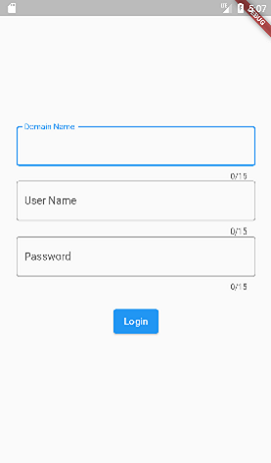
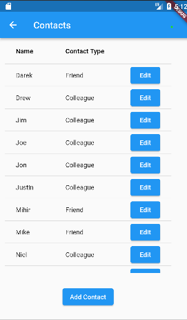
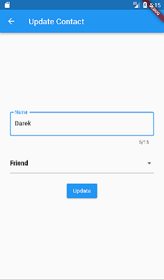

# famark-cloud-api-flutter-example
This is a sample code showing how to call Famark Cloud API to store and retrieve data through Flutter mobile app with Dart programming language.

## Getting Started:

### Prerequisites:
* Famark Cloud Domain
* Android Studio
* Flutter

### Installation:
For help getting started with Famark Cloud, watch the [Getting Started](https://www.youtube.com/watch?v=zo64uiMoiaA) video.

1. Register a Famark Cloud Domain at [https://www.famark.com/Install/?ic=FreePlatform](https://www.famark.com/Install/?ic=FreePlatform) The invite code is FreePlatform. 
2. Create an Entity 'Contact' and add attributes 'Name' and 'Contact Type' with System Name as 'Name' and 'ContactType' to it.
3. Add some records to the Contacts entity.
4. Clone the repo
   ```sh
   git clone https://github.com/famarkcloud/famark-cloud-api-flutter-example.git
   ```
5. Open the project and Configure the Flutter SDK path in Android Studio.
6. Install the flutter dependencies using command: pub get

## Output:

### Login Screen &nbsp;&nbsp; &nbsp; &nbsp; &nbsp;&nbsp; &nbsp; &nbsp; &nbsp;&nbsp; &nbsp; &nbsp; &nbsp;&nbsp; &nbsp; &nbsp; &nbsp; &nbsp; &nbsp; &nbsp; &nbsp;&nbsp; &nbsp; &nbsp; &nbsp;Retrieve Contacts Screen

&nbsp; &nbsp; &nbsp; &nbsp;

### Create Contact Screen &nbsp;&nbsp; &nbsp; &nbsp; &nbsp;&nbsp; &nbsp; &nbsp; &nbsp; &nbsp; &nbsp; &nbsp; &nbsp;&nbsp; &nbsp; &nbsp; Update Contact Screen

&nbsp; &nbsp; &nbsp; &nbsp;
