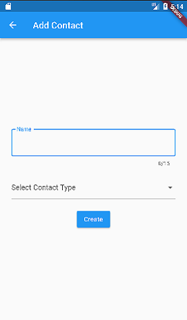

# famark-cloud-api-flutter-example
This is a sample code showing how to call Famark Cloud API to store and retrieve data through Flutter mobile app with Dart programming language.

### Setup Steps:
1. This example requires **Famark Cloud Instance**, you can [register free instance](https://www.famark.com/Install/?ic=FreeDev) or sign in to your [existing instance](https://www.famark.com/) or [*download*](https://www.famark.com/cloud/products.htm) *Famark Cloud* for *Windows* or *Linux* platforms from [famark.com/cloud/products.htm](https://www.famark.com/cloud/products.htm).
2. This example performs *Create, Retrieve, Update and Delete (CRUD)* actions on *Contact* entity present in *Business Solution*, so make sure you have the Business solution installed in your instance, if not then goto:- 
*`Solutions > more actions (...) > Import Solution > Import From Store > Business Solution Install > Import Solution`*
3. Clone this repository and run `npm install` from root to get package dependencies.
4. Run the application with `npm start` enter your famark cloud credentials and perform CRUD operations on Business Contact entity from NodeJS. 

*You can modify the code to perform these operations on your own entities.*

## Getting Started:

### Prerequisites:
* Famark Cloud Domain
* Android Studio
* Flutter

### Installation:

1. Register a Famark Cloud Domain at [famark.com/Install/?ic=FreePlatform](https://www.famark.com/Install/?ic=FreePlatform) The invite code is FreePlatform. 
2. Create an Entity 'Contact' and add attributes 'Name' and 'Contact Type' with System Name as 'Name' and 'ContactType' to it.
3. Add some records to the Contacts entity.
4. Clone the repo
   ```sh
   git clone https://github.com/famarkcloud/famark-cloud-api-flutter-example.git
   ```
5. Open the project and Configure the Flutter SDK path in Android Studio.
6. Install the flutter dependencies using command: pub get

## Output:

### Login Screen &nbsp;&nbsp; &nbsp; &nbsp; &nbsp;&nbsp; &nbsp; &nbsp; &nbsp;&nbsp; &nbsp; &nbsp; &nbsp;&nbsp; &nbsp; &nbsp; &nbsp; &nbsp; &nbsp; &nbsp; &nbsp;&nbsp; &nbsp; &nbsp; &nbsp;Retrieve Contacts Screen

&nbsp; &nbsp; &nbsp; &nbsp;

### Create Contact Screen &nbsp;&nbsp; &nbsp; &nbsp; &nbsp;&nbsp; &nbsp; &nbsp; &nbsp; &nbsp; &nbsp; &nbsp; &nbsp;&nbsp; &nbsp; &nbsp; Update Contact Screen

&nbsp; &nbsp; &nbsp; &nbsp;
